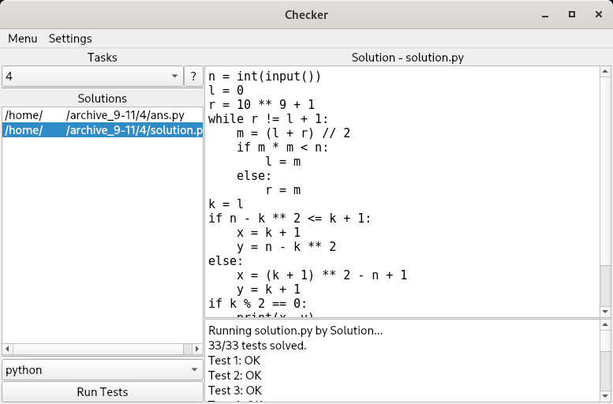

# Program checker & testing system

Приложение на Python и PyQt5 для проверки и тестирования программ и решений олимпиадных задач.

Особенности:

* Объединение решений по задачам;
* Возможность проверки по множеству тестов;
* Проверка решений на языках программирования Python, C++ и Go;
* Запуск решений в изолированных контейнерах.

### Установка

Для установки требуются:

Docker >= 20.10.7 - https://docs.docker.com/get-docker/

Python >= 3.9 - https://www.python.org/downloads/

Выполните в терминале:

```
pip install -r requirements.txt
```

Внимание! Для правильной работы на Linux Docker должен запускаться без прав root. Выполните инструкции с https://docs.docker.com/engine/install/linux-postinstall/.

### Использование

Для запуска выполните `front-main.py` через Python.

При первом запуске решения на каком-либо языке Docker будет устанавливать контейнеры для соответствующего языка, что может занять длительное время. Установка выполняется лишь один раз для каждого языка. Просьба не закрывать программу в течении этого процесса.



